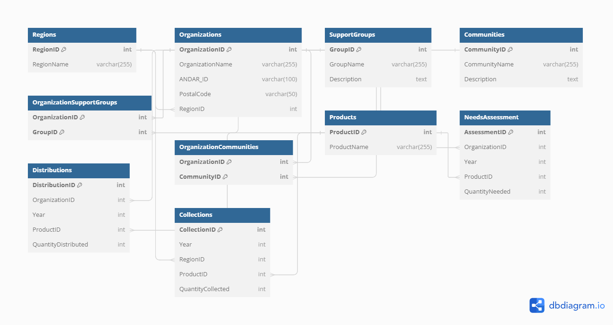

# Solving Period Poverty in BC - Capstone Project

## Overview

This repository is home to the Capstone Project conducted by students from Northeastern University's Masters in Analytics and AI Specialty class of 2024. The project's goal is to apply data science and analytical techniques to tackle period poverty across British Columbia, optimizing the distribution of period products and ensuring effective allocation of resources.

## Project Objective

The objective of this project is to harness the power of data to address the challenges associated with period poverty. Through extensive data analysis, we aim to improve the understanding of needs, streamline distribution efforts, and support the decision-making processes of organizations involved in this cause.

## Gratitude and Acknowledgements

We are deeply grateful to our university, [Northeastern University Vancouver](https://vancouver.northeastern.edu/), for the opportunity to work on this impactful project. Special thanks to our mentor, [Professor Chinthaka Dinesh](https://www.linkedin.com/in/chinthaka-dinesh-a4a206196/), for his invaluable guidance and mentorship.

Our heartfelt appreciation goes to our sponsors, the [UWBC](https://uwbc.ca/) team, [Alexa Graf](https://www.linkedin.com/in/alexa-graf1995/) and Dama, for their support and engagement in this initiative.

## Project Members

The project was brought to life by a dedicated team of Northeastern University students:

- [Swathi Raikwar](https://www.linkedin.com/in/swathi-raikwar-b9456345/)
- [Shamim Sherafati](https://www.linkedin.com/in/shamim-sherafati97/)
- [Larissa Anoh](https://www.linkedin.com/in/larissaanoh1/)

## Project Structure

- `ETL_Tools/`: Python scripts for the ETL process to prepare the data.
- `Database_Schema/`: SQL scripts for creating a structured database schema.
- `PowerBI_Dashboards/`: Interactive Power BI dashboards for visual analytics.
- `Documentation/`: Detailed guides on utilizing the tools and scripts.
- `ER_Diagrams/`: Visual representations of the database schema.
- `Data/`: Data files for ETL and Power BI analysis.

## Key Components

- **ETL Process**: A set of tools for data preparation and transformation.
- **Database Schema**: SQL database schema with an ER diagram for data organization.

- **Power BI Dashboards**: Visualizations that provide insights into product distribution and needs.

- **Documentation**: In-depth instructions on the ETL process, database schema setup, and dashboard usage.

## Usage

To use this project's resources:

1. Run the ETL scripts to process raw data into an analyzable format.
2. Execute SQL scripts to establish the database schema.
3. Use Power BI dashboards to visualize and interpret the data.
4. Consult the documentation for step-by-step guides on each component.

---

For detailed information on each project component, refer to the respective documentation and READMEs within each directory.
