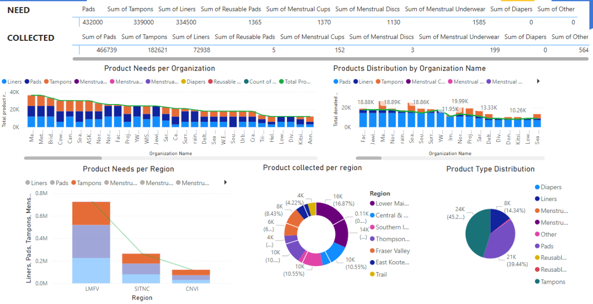

# Power BI Dashboard for Period Product Distribution Project

## Overview

This Power BI dashboard provides an interactive and visual analysis of period product needs, distribution, and collection data. It is designed to assist stakeholders in making informed decisions regarding resource allocation and campaign focus.

## Dashboard Visualization Features

### Key Visuals Included:

- **NEED vs. COLLECTED**: Displays the total required versus collected products, offering a quick overview of supply status.
- **Product Needs per Organization**: A bar chart presenting the quantity of products needed by each organization, highlighting demand distribution.
- **Products Distribution by Organization Name**: Mirrors the needs per organization, focusing on actual distribution.
- **Product Needs per Region**: A stacked area chart showing product needs across different regions, identifying demand trends.
- **Product Collected per Region**: A donut chart providing a breakdown of total product collections by region.
- **Product Type Distribution**: A pie chart depicting the variety of product types collected, offering insights into the diversity of supplies.

## Using the Dashboard

To navigate the dashboard:

- Use filters to display data for specific products, organizations, or regions.
- Hover over chart segments to view detailed data points.
- Click on chart elements to interactively filter other visuals based on the selected criteria.

## Purpose and Application

The dashboard aims to:

- Pinpoint areas with pressing needs or excess supplies to optimize resource distribution.
- Track collection and distribution trends for strategic planning of future campaigns.
- Reveal gaps between the needs and distributions, directing attention to underserved areas.

## Conclusion

With this Power BI dashboard, complex data is synthesized into strategic insights, empowering stakeholders to address period poverty with data-driven actions. It serves as a crucial tool in understanding the impact of distribution efforts and identifying areas for improvement.

---

For more detailed analysis and custom views, the Power BI file (`Capstone.pbix`) can be further explored with Power BI Desktop.
