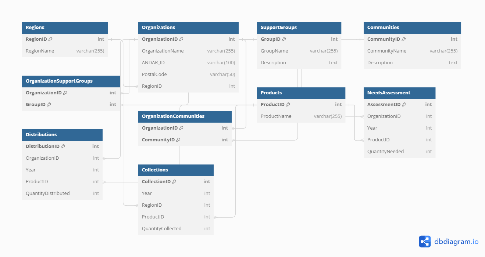

# SQL Database Schema and ER Diagram Documentation

## Introduction

This documentation describes the SQL database schema created for managing the data related to period product distribution, needs assessment, and organizational support efforts. It includes an Entity-Relationship Diagram (ERD) to visually represent the schema.

## Database Schema

The database consists of the following tables:

- `Regions`: Contains details about the geographic regions.
- `Organizations`: Stores information on organizations, including a reference to their region.
- `SupportGroups`: Lists various support groups that an organization may be associated with.
- `Communities`: Details the communities that are supported by the organizations.
- `OrganizationSupportGroups`: A junction table that represents a many-to-many relationship between organizations and support groups.
- `OrganizationCommunities`: A junction table that represents a many-to-many relationship between organizations and communities.
- `Products`: Catalogs the types of menstrual products.
- `NeedsAssessment`: Captures the needs assessment data for the organizations.
- `Distributions`: Records the distribution of products to organizations.
- `Collections`: Details the product collection campaigns.

## Entity-Relationship Diagram (ERD)

Below is the ERD which visualizes the structure of the database schema. It outlines the tables, their relationships, and how data is interconnected within the database.

## How to Use the Schema

1. Execute the SQL script to create the tables in your SQL database environment.
2. Populate the `Regions`, `SupportGroups`, `Communities`, and `Products` tables with the necessary data.
3. Use the ETL tool to import data into the `Organizations`, `NeedsAssessment`, `Distributions`, and `Collections` tables.
4. Establish the relationships between tables using the `OrganizationSupportGroups` and `OrganizationCommunities` junction tables.

## Additional Notes

- Make sure to maintain the integrity of the relationships as defined by the foreign keys.
- Ensure all mandatory fields are populated during the data import process.
- The ERD can be used as a reference to understand the relationships and to ensure that the data import adheres to the schema structure.

## Conclusion

This schema is crafted to provide a robust foundation for managing and analyzing data for period product distribution efforts. It allows for comprehensive reporting and querying capabilities to support the decision-making processes for organizations involved in these initiatives.
